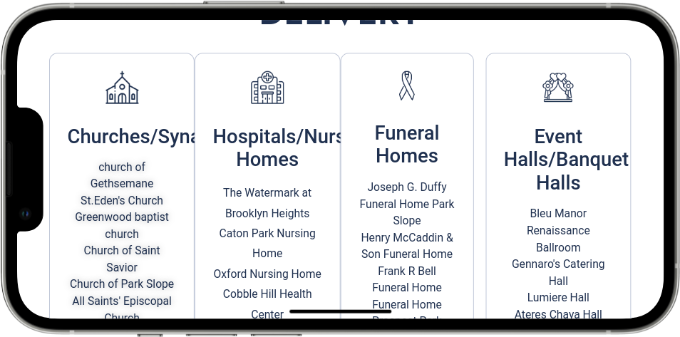

# Read Me

1. Usa como referencia de diseño el [THBDesignSystem.pdf](/THBDesignSystem.pdf) para obtener los elementos y componente en css, e implementarlos en las clases respectivas definidas en desarrollo.

2. Puedes correr el index.html para obtener un prototipo de alta fidelidad de los elementos más relevantes. Este html no representa el sitio completo es sólo una referencia.

3. El css javxstyle.cc esta escrito con arquitectura BEM para mejor comprención de las nomenclaturas. Puedes copiar los componentes directamente en las clases respectivas definidas, por ustedes, en desarrollo.

4. La iconografía utilizada es fontaweson, pero la iconografía que utiliza la versión anterior del sitio esta muy bien. Solo se requiere adaptarle los parametros de color y dimensión que están expresados en el javxstyle.css.

5. ***Errores css a corregir de la versión anterior** Las siguentes imágenes muestran la incompatibilidad del css generado por Elementor con diferentes formatos de pantallas. El javxstyle.css debería corregir estos errores, sin embargo, revisar bien para evitar que no se garantice el responsive.
   
   1. Utilizar mediaquerys para corregir el título de las cards de manera que reduzca su font-size y se adapte a la nueva dimensión, utilizar flexbox correctamente para ello.
      
      
      
      
      
      2. Igualmente con flexbox se puede garantiza un gap adecuado para mantener la disposición armónica entre las card, en el javxstyle.css se utiliza un estándard de 24px.
      
      3. En la sección de About Us no se incorporó un margin-bottom para separar el título secundario del paragráfo, este error es evidente inclusive en la versión monitor pc.
      
      4. Eliminar el H1 "Browse Floral Arrangements", el boton see all flowers lleva a esa sección y no es necesario que esté el título abajo.
         
         

Para eventuales informaciónes y dudas por favor contactarme al 0412-6033153

Buen trabajo!

